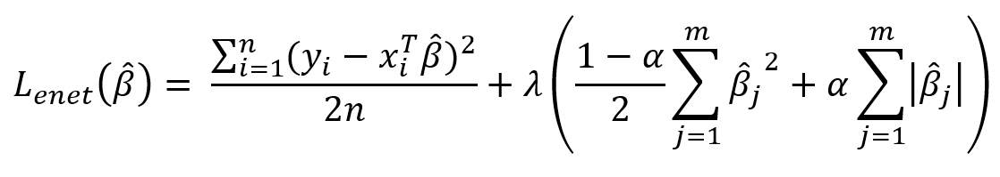

```{r setup, include=FALSE}
knitr::opts_chunk$set(echo = TRUE)
library(ggplot2)
```

## Read data

```{r}
load("cancer.RData")
```

## 1
Liczba zmiennych objaśniających
```{r}
length(data.train) - 1
```
Grafiki
```{r}
train <- data.frame(data.train)
means <- c()
sds <- c()
wz <- sapply(train, sd) / sapply(train, mean)
sorted <- sort(wz, decreasing = TRUE)[1:50]
df <- data.frame(sorted)
corpij <- function(i,j,data) {cor(data[i], data[j])}
corp <- Vectorize(corpij, vectorize.args=list("i","j"))
cormat <- outer(rownames(df),rownames(df),corp,data=train)
ggplot()+geom_violin(aes(c(cormat), c(cormat)))
plot_df <- reshape2::melt(cormat)
ggplot(plot_df) + geom_tile(aes(Var1, Var2, fill = value))
```

## 2
Elastic Net jest metod regresji, która oprócz minimalizacji sumy kwadratów błędów minimaluzuje także sumę kwadratów współczynników (jak w Ridge Regression) oraz sumę wartości bezwzględnych współczynników (jak w Lasso Regression). \
Parametrami Elastic Net są: \
estymowane: \
- beta z daszkiem, wagi z jakimi brane są wartości zmiennych objaśniających \
tuningowe: \
- lambda, prametr ten reguluje jaki wpływ na stratę mają kary związane z współczynnikami modelu \
- alfa - paramter ten reguluje stosunek z jakim kary dotyczące współczynników są brane pod uwagę \
\
Oto funkcja którą minimalizuje Elastic Net. \
```{r}

```

## 3
Wybór modelu Elastic net(pomysł autorski). \
1. wylosować pewną ilość par(np 10) wartośći z rozkładu jednostajnego o przedziale (0, 1). \
2. na podstawie każdej świeżo wylosowanej pary, oraz par A, B z poprzedniego losowania (jeśli takowe istnieją) stworzyć model o parametrach lambda oraz alfa takich, że lambda / (1 + lambda) jest równe para[1], alfa jest równe para[2] \
3. przeprowadzić Cross Validation, i wybrać dwie najlepsze pary(nazwijmy je A oraz B). \
4. wylosować pewną ilość par(np 10), takich, że para[i] jest losowana z rozkładu jednostajnego z  przedziału pomiędzy A[i] oraz B[i]  \
5. skok do punkty 2 \
\
Algorytm możemy zakończyć np po ustalonej ilości obrotów pętli, gdy przedziały do losowania liczb będą mniejsze niż ustalony epsilon, lub gdy model A lub B zbyt długo się nie zmienia. \
\
Wybór modelu Random Forest(https://www.analyticsvidhya.com/blog/2020/03/beginners-guide-random-forest-hyperparameter-tuning/). \
Pod tym linkiem jest opisany bardzo prosty sposób. \
Dla każdego parametru wykonujemy: \
1. losujemy pozostałe parametry \
2. sprawdzamy, jak zmieniają się wyniki modelu dla treningu oraz walidacji \
3. ustalamy parametr na taki, że wynik walidacji jest relatywnie wysoki, ale nie doszło do overfittingu podczas treningu \
\

## 4
